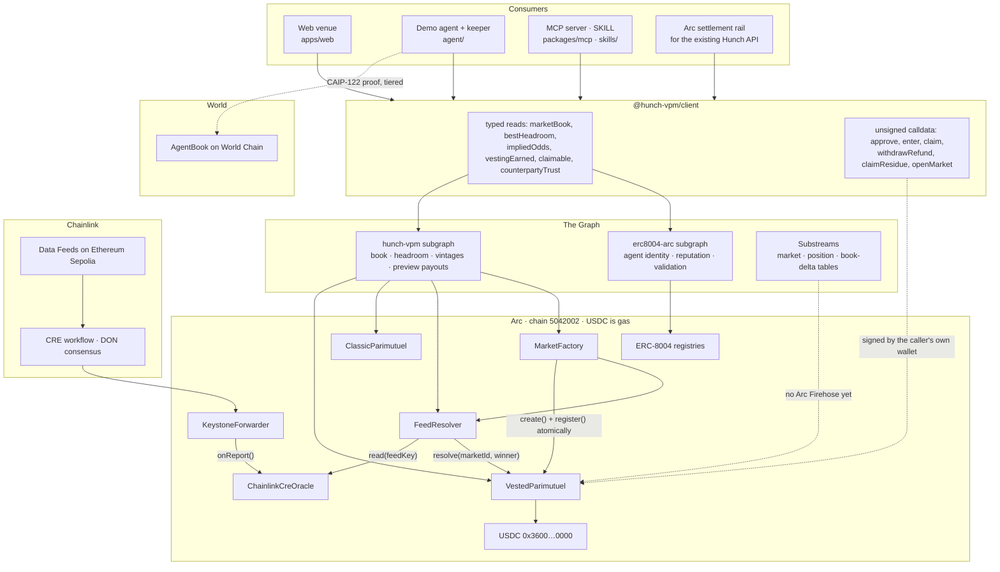
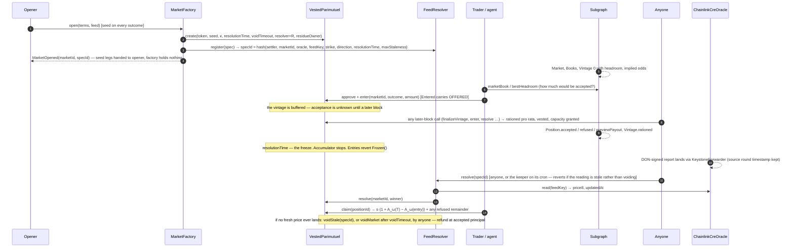

<h1 align="center">Hunch VPM</h1>

<p align="center"><strong>The Vested Parimutuel, on Arc.</strong><br/>
A prediction market that pays you for the risk you carried, not for the second you showed up.</p>

<p align="center">
  <a href="https://vpm.playhunch.xyz">Live venue</a> ·
  <a href="https://www.playhunch.xyz/vpm-whitepaper">The whitepaper</a> ·
  <a href="https://testnet.arcscan.app/address/0xC743940C75619f65F6178b7e49c0C3A0bE012Eec">Settler on Arcscan</a> ·
  <a href="docs/ARCHITECTURE.md">Architecture</a>
</p>

<p align="center">
  <a href="https://github.com/rajkaria/hunch-vpm/actions/workflows/ci.yml"></a>
  
  
  
</p>

---

Every prediction market ever built has had to answer one question: **what is a dollar worth
when it arrives?** Order books answer it with a quote, which means a market exists only when
a market maker shows up. Pools answer it with a share of the pot, which means a dollar that
arrives ten seconds before the buzzer, already knowing the answer, is paid exactly the same
multiple as the dollar that carried the risk all day.

Hunch VPM is the first venue built on a third answer, published this month as
[*The Vested Parimutuel*](https://www.playhunch.xyz/vpm-whitepaper) (Karia, Hunch Research,
second edition, September 2026): **every dollar that arrives belongs to whoever was already on
the other side.** Stake vests into the opposing books the moment it lands, and is accepted only
up to the room those books have to cover it. Under that rule the payout multiple is strictly
decreasing in arrival time, a buzzer-beater earns exactly 1.00×, and nobody who took the early
risk can be diluted by anyone who came later. The paper proves it; this repository ships it.

It is USDC-native on Arc, where the stake asset and the gas asset are the same thing. The whole
book is indexed on The Graph as *decisions* rather than rows. Markets resolve from Chainlink
Data Feeds with no human in the loop. AI agents trade it through a typed client, three MCP
tools and a SKILL, and a human-backed agent (World AgentKit) is tiered up rather than an
anonymous one being shut out. The venue never custodies anything, and that is asserted by an
invariant suite rather than promised in prose.

## At a glance

| | |
|---|---|
| **Mechanism** | Vested parimutuel: Rule 1 flow vesting, Rule 2 capacity matching, block vintages, O(1) accumulator settlement |
| **Reference implementation** | `VestedParimutuel.sol`, vendored byte-for-byte from the paper; 118 published conformance vectors replay in CI |
| **Chain** | Arc testnet (chain id `5042002`), five contracts deployed and verified on Arcscan; mainnet (`5042`) not yet |
| **Stake asset** | USDC, which is also Arc's native gas token |
| **Live markets** | BTC / USD ≥ $77,000 at 2026‑09‑15 16:00 UTC · ETH / USD ≥ $2,500 at 2026‑09‑20 16:00 UTC |
| **Resolution** | `FeedResolver` reading Chainlink Data Feeds through a CRE relay; anyone may call, nobody decides |
| **Indexing** | Two subgraphs live in Subgraph Studio on `arc-testnet`, plus a Substreams package |
| **Agent surface** | `@hunch-vpm/client`, `@hunch-vpm/mcp` (3 tools), a SKILL, `@hunch-vpm/agentkit-tier`, a demo agent on a Circle Agent Wallet |
| **Venue** | <https://vpm.playhunch.xyz>, Next.js, wallet → Arc → estimate → approve → enter → close vintage → claim |
| **Verification** | `pnpm verify`, one gate, ~1,400 tests across Foundry, Vitest, Matchstick, Rust and bun; CI runs the same |
| **Custody** | None. The client returns unsigned calldata; the invariant suite proves no address can move a position it does not own |

## If you have five minutes

1. Read [The problem](#the-problem-a-pool-pays-late-money-like-early-money) and
   [The mechanism](#the-mechanism-what-the-whitepaper-changes). Ten paragraphs and one worked
   example are enough to see why this is a different market, not a different UI.
2. Open <https://vpm.playhunch.xyz>, switch the header toggle to **Arc testnet**, open a market.
   The capacity meters, the vesting curve and the resolution spec are things no other prediction
   market page has to draw, because no other rule produces them.
3. Open [`contracts/test/Invariants.t.sol`](contracts/test/Invariants.t.sol). A stranger tries
   every method on every path 8,192 times per run and ends with the same balance it started with.
4. Run `pnpm verify`. Everything below is checked by it.

---

## Contents

- [The problem: a pool pays late money like early money](#the-problem-a-pool-pays-late-money-like-early-money)
- [The mechanism: what the whitepaper changes](#the-mechanism-what-the-whitepaper-changes)
  - [Two rules](#two-rules)
  - [A worked example](#a-worked-example)
  - [What the paper proves](#what-the-paper-proves)
  - [Measured on a real tape](#measured-on-a-real-tape)
  - [Against every other market structure](#against-every-other-market-structure)
  - [What the paper does not claim](#what-the-paper-does-not-claim)
- [From paper to venue: what this repository adds](#from-paper-to-venue-what-this-repository-adds)
- [Architecture](#architecture)
  - [The life of a market](#the-life-of-a-market)
  - [Settlement layer](#settlement-layer)
  - [Resolution](#resolution)
  - [Indexing layer](#indexing-layer)
  - [Agent layer](#agent-layer)
  - [Identity layer](#identity-layer)
  - [The venue](#the-venue)
- [Why Arc](#why-arc)
- [Sponsor integrations](#sponsor-integrations)
- [Trust model](#trust-model)
- [What is deployed right now](#what-is-deployed-right-now)
- [Verification](#verification)
- [Run it](#run-it)
- [Repository map](#repository-map)
- [What is not done](#what-is-not-done)
- [Provenance](#provenance)
- [License](#license)

---

## The problem: a pool pays late money like early money

There are two families of prediction market and each has a flaw the other does not.

**Order books and AMMs** (Polymarket, LMSR-style markets, CFMMs) quote a continuous price and
let you exit at any time. The cost is that someone has to make the market: an order book with
no maker is an empty page, an LMSR needs a subsidy, a CFMM needs seeded liquidity on both sides.
So they only quote the questions somebody with capital finds worth quoting, which is why every
order-book venue lists the same few hundred markets.

**Parimutuel pools** (racetracks, and the live [Hunch](https://www.playhunch.xyz) product
today) work from the first dollar. Everybody's stake goes into one pot, the winning side splits
the losing side pro rata, and no maker is needed. Any question can have a market. The cost is
that the pool has no notion of *when* a dollar arrived. Every unit of winning stake is paid
`pool / winningPrincipal`, so the trader who took the unpopular side at open and the trader who
arrived a second before the freeze, with the outcome already visible on a screen, are paid the
same multiple. Worse, the late trader's arrival *reduces* the early trader's multiple, because
they now share the same losing pool. Pools have always been worth arriving late to, and every
pool operator has fought that with locks, cutoffs and hand-tuned closing times, none of which
change the rule.

This is not hypothetical. The whitepaper replays Hunch's own tape, **5,291 resolved markets
and 779,549 trades** from a live paper-money parimutuel tournament, and finds that under the
classic rule winners entering in the last decile captured a **median 70.1%** of the losing pool,
and that early winners were diluted by a **median 38.7%** by money that arrived in the final 5%.
Traders who entered in the final 5% of a market's life earned **1.487×** on their winning
positions. That is the buzzer-beater's premium, paid for by the people who carried the risk.

And every one of those markets settled off-chain: a Postgres book, with the operator as
resolver, payer and custodian.

## The mechanism: what the whitepaper changes

[*The Vested Parimutuel: Settling prediction markets by time priority of capital at risk*](https://www.playhunch.xyz/vpm-whitepaper)
was written and published during this hackathon by Hunch Research, together with a reference
Solidity implementation, a 118-vector conformance suite, simulation scripts and the full tape
replay. Text is CC BY 4.0, code and contract are MIT, and any venue on any chain may implement
it without permission. This repository is the first venue that does.

### Two rules

**Rule 1, flow vesting.** When a stake `c` arrives on outcome `o`, it vests immediately and
irrevocably into every *opposing* book, pro rata by the principal already there. Whoever was
on the other side when your money arrived owns a claim on it, contingent on their outcome
winning. Nothing that arrives later can revise that claim.

**Rule 2, capacity matching.** A position of size `s` grants its book `κ · s` of matching
capacity. A book's **headroom** is `H = capacity − vested`, the room it has left to absorb
stake from the other side. An incoming stake is accepted only up to the smallest headroom among
the books it would vest into. Anything beyond that is refused and refunded, which is a normal
outcome and not an error.

Everything else in the paper follows from those two sentences.

- **Payout.** A position `i` of accepted size `s_i` on the winning outcome `ω` is paid

  ```
  Π_i = s_i · (1 + A_ω(T) − A_ω(τ_i))
  ```

  its principal, plus its share of everything that vested into its book *after* it arrived.
  `A_ω` is a reward-per-share accumulator per outcome: on every accepted stake `c` on `o`, for
  each `w ≠ o`, `A_w += c / P_w`. That makes entry, resolution and claim each **O(1)**, with no
  loop over opposing positions.
- **Vintages.** Entries in the same block form one vintage. They vest against the books as they
  stood at the start of the block, they never vest to each other, and they are rationed
  together against headroom in a single pro-rata pass. There is no intra-block ordering game to
  play.
- **The seed.** Every market opens with a stake on every outcome, in a reserved vintage 0 whose
  legs are each other's counterparties. Books are never empty, Rule 2 is sound without external
  guards, and the creator recovers at least the total seed in every branch.
- **The freeze.** The resolution timestamp is fixed at creation and never moves. The accumulator
  stops there regardless of when resolution actually happens, so delaying resolution farms
  nothing and entries at or after the freeze are refused outright.
- **Pull settlement.** Winners claim; refused remainders are withdrawn; the flooring residue has
  a named owner fixed at creation.

### A worked example

A binary market, YES / NO, seeded 100 / 100, with κ large enough not to bind. Three traders
arrive in three separate blocks and YES wins.

| Block | Event | Vests into | `A_YES` | `A_NO` | `P_YES` | `P_NO` |
|---|---|---|---|---|---|---|
| 0 | seed 100 YES, 100 NO | each other | 1.00 | 1.00 | 100 | 100 |
| 1 | **Alice** stakes 100 on YES | NO book: `100 / 100` | 1.00 | 2.00 | 200 | 100 |
| 2 | **Bob** stakes 100 on NO | YES book: `100 / 200` | 1.50 | 2.00 | 200 | 200 |
| 3 | **Carol** stakes 200 on YES, late | NO book: `200 / 200` | 1.50 | 3.00 | 400 | 200 |

YES resolves. `A_YES(T) = 1.50`. Each winning position is paid `s · (1 + 1.50 − A_YES at entry)`:

| Position | Entered at `A_YES` | Vested rule | Classic rule |
|---|---|---|---|
| Seed YES leg | 0.00 | 100 · 2.50 = **250** (2.50×) | 150 (1.50×) |
| Alice | 1.00 | 100 · 1.50 = **150** (1.50×) | 150 (1.50×) |
| Carol | 1.50 | 200 · 1.00 = **200** (1.00×) | 300 (1.50×) |
| **Total** | | **600** = the whole pool | 600 |

Both rules conserve the pool. But under the classic rule every winner gets 1.50× no matter when
they arrived, and Carol, who entered last and vested nothing to anyone, takes 300 of it. Under
the vested rule the multiple is 2.50×, 1.50×, 1.00× in order of arrival: the seed carried the
risk longest and is paid most; Carol entered after all the NO money had already been claimed by
the people who were there when it arrived, and gets exactly her principal back.

Now remove Carol. Under the classic rule Alice would have been paid `100 · 400 / 200 = 200`,
so Carol's arrival diluted her by 25%. Under the vested rule Alice is paid 150 with or without
Carol. **Nothing that arrives after you can take anything from you.** That is Property P3, and
it is an identity, not an incentive.

### What the paper proves

| | Property | What it means at the venue |
|---|---|---|
| **P1** | Conservation | Payouts sum to the accepted pool exactly, in integer units. The settler cannot overpay. |
| **P2** | Monotone floor | `s_i + vested_i(t)` never decreases. A position's worth-if-it-wins only ever goes up. |
| **P3** | Claim invariance | Vesting already accrued is never revised by a later entry. No same-side dilution. |
| **P4** | Late-entry neutrality | The final opposing entrant is paid exactly principal. The buzzer snipe earns 1.00× and carries the full loss. |
| **P5** | Scale invariance | The multiple is bounded by `1 + κ(1 + ln g)` where `g` is the book's growth after entry. Dust earns the same multiple as size; leverage is bounded. |
| **P6** | Creation floor | The creator recovers at least the total seed in every branch. Seeding a market is floored, so permissionless creation is affordable. |
| **P7** | Blend degradation | A blend `λ` between this rule and the classic one buys late hedging at the price of P4 and P6. Stated as a trilemma; this venue runs `λ = 1`. |

Two engineering results sit beside the properties. The accumulator form is **constant-time in
the size of the book**: the naive loop over opposing positions costs ~5,000 gas per position
and reaches 5.5M gas at a thousand of them, while the accumulator entry is flat at 130k–170k
(measured, [`contracts/GAS.md`](contracts/GAS.md)). And the fixed-point residue is bounded by
`W + Σ s_i · m_i / S`, so `S = 10^18` keeps it to dust for a 6-decimal stablecoin.

### Measured on a real tape

The paper's §13.4 replays every one of those 5,291 markets under both rules, with the same
trades in the same order.

| Measure | Classic rule | Vested rule |
|---|---|---|
| Losing pool captured by last-decile winners, median | 70.1% | **0.08%** |
| Multiple earned by traders entering in the final 5% | 1.487× | **1.00×** |
| First-decile winners' multiple, median | 1.23× | **2.72×** |
| Early winners' dilution from final-5% inflow, median | 38.7% | **0.00%** |
| Creator seed negative | — | **0 of 5,173** settled markets |
| Conservation | — | exact in all 5,173 |

The simulation study (2,000 markets × 20 seeds) agrees in direction and adds the behavioural
consequence: first-phase inflow rises from 32.9% of volume to 43.9%, and late-phase inflow
collapses from 5.1% to 1.7%. When late money is not free, it stops arriving late.

These figures are the paper's. This repository is the mechanism, not the study, and nothing
here recomputes them.

### Against every other market structure

| Requirement | Order book | CFMM | LMSR | Classic pool | **Vested parimutuel** |
|---|---|---|---|---|---|
| Continuous entry | ✓ | ✓ | ✓ | ✗ (locks) | **✓** |
| Works from the first dollar | ✗ | ✗ | ✗ | ✓ | **✓ (seeded)** |
| No subsidy required | ~ | ✗ | ✗ | ✓ | **✓ (floored seed)** |
| Entry-time integrity | ✓ | ✓ | ✓ | ✗ | **✓ (P4)** |
| Systematic reward for early risk | ✗ | ✗ | ✗ | ✗ | **✓** |
| Late hedge / exit | ✓ | ✓ | ✓ | ✗ | ✗ (§14) |
| Live late price | ✓ | ✓ | ✓ | ~ | ✗ (§8) |

The last two rows are the trade. The paper's answer is a secondary layer (§8) where dealers
price a position's *floor tranche* (a digital option, known at any moment) separately from its
*flow tranche* (a forward yield). That is deployment step two in the paper's own roadmap and it
is not in this repository; positions are transferable, which is the primitive it needs.

### What the paper does not claim

The paper has a §14 titled *Limitations* and a section on what it does not claim. Both are
worth reading before anything else in this README, and their content shapes what was built:

- **Finite κ breaks at n ≥ 3.** Multi-outcome markets can hit an absorbing freeze; the
  prescription is unbounded κ, and the contract has a sentinel for it. Both live markets are
  binary with κ = 30.
- **Late forecasts degrade.** A pool ratio is not a live probability under fast growth. Late
  information has to come through the secondary layer, not the pool.
- **No hedging near resolution** at λ = 1. Markets that need it should run interior λ and give
  up the creation floor.
- **Inter-block MEV is open.** Vintages make a block order-free, but a front-runner across
  blocks can still capture `c · f / (P + f)`. Commit-reveal or an encrypted mempool is the fix,
  and neither is here.
- **No equilibrium theorem.** Whether rational flow keeps arriving through a market's life,
  given public accrued claims and negative late EV, is left open.

---

## From paper to venue: what this repository adds

The paper ships a settler and a proof. A market needs a great deal more: something to open
markets so nobody can stake against rules that have not been committed to yet; something to
resolve them without a human; something to index them so an agent is not sweeping an RPC to
price a book; a way for agents to trade them without holding the venue's keys; a way to tell a
verified human's agent from a wallet farm; and a surface a person can use. All of that is new
here, and every piece of it is written against the mechanism rather than around it.

| Layer | What is here | Path |
|---|---|---|
| **Settlement**, on Arc | `VestedParimutuel` (vendored) and `ClassicParimutuel` (new) behind one `IParimutuelSettler`; `FeedResolver`; `MarketFactory`; oracle adapters for Chainlink Data Feeds, Chainlink CRE and Stork | [`contracts/`](contracts) |
| **Indexing**, on The Graph | The venue subgraph, computing headroom, implied odds, vesting and preview payouts in the mapping | [`subgraph/`](subgraph) |
| **Indexing**, standardized | Agent0's ERC-8004 schema retargeted at Arc's three registries | [`subgraph-erc8004-arc/`](subgraph-erc8004-arc) |
| **Indexing**, streamed | A Rust Substreams package producing market, position and book-delta tables | [`substreams/`](substreams) |
| **Resolution feed** | A Chainlink CRE workflow relaying Sepolia Data Feeds onto Arc testnet through the KeystoneForwarder | [`cre/`](cre) |
| **Agent surface** | `@hunch-vpm/client` (typed reads, unsigned writes, the Arc settlement rail), `@hunch-vpm/mcp` (three tools), a SKILL | [`packages/client`](packages/client), [`packages/mcp`](packages/mcp), [`skills/hunch-vpm`](skills/hunch-vpm) |
| **Identity** | `@hunch-vpm/agentkit-tier`: World AgentKit proof verification and tiering | [`packages/agentkit-tier`](packages/agentkit-tier) |
| **Demo agent** | research → decide → enter → monitor → claim on a Circle Agent Wallet, paying for intel with Gateway Nanopayments; plus the resolution keeper | [`agent/`](agent) |
| **Venue** | The board, market pages, the acceptance estimate, claims, portfolio, the agent leaderboard | [`apps/web/`](apps/web) |
| **Operations** | Deploy scripts, address wiring with drift detection, preflight, CI, a scheduled keeper | [`scripts/`](scripts), [`.github/workflows`](.github/workflows) |

---

## Architecture

Three layers, each usable without the ones above it.



### The life of a market



Two details in that sequence are the ones that took the most care, because the contract makes
them true and every layer above has to respect them.

**The entry has three states.** `enter` pushes a position with `accepted = 0`, pulls the full
amount, and emits `Entered` carrying `offered`, never `accepted`. Rationing happens in
`_finalizeVintage`, on the first call to touch the market in a *later* block. So between
entering and the vintage closing, the position is in, the books have not ruled, and
`finalizeVintage` is callable by anyone. The subgraph, the client, the agent and the web surface
all model that state explicitly rather than pretending acceptance is known at entry.

**Refusal is not failure.** The transaction does not revert when the books lack room; a smaller
amount is accepted and the remainder becomes a refundable balance. Every quote in this
repository reports `requested`, `accepted` and `refused` separately, and names the book that
bound it.

### Settlement layer

[`contracts/`](contracts) · Foundry · Solidity 0.8.28 · 13 test suites

| Contract | Role | Origin |
|---|---|---|
| [`VestedParimutuel.sol`](contracts/src/VestedParimutuel.sol) | The mechanism. One contract, many markets. Rule 1, Rule 2, vintage-0 seed with the fixed-point clamp, lazy block vintages, the O(1) accumulator at `S = 1e18`, pull claims, residue owner, freeze | Vendored **byte-for-byte** from the paper's reference implementation ([`VENDORED.md`](contracts/VENDORED.md)) |
| [`ClassicParimutuel.sol`](contracts/src/ClassicParimutuel.sol) | The rule the live Hunch product runs today, `floor(pool × stake / winningPrincipal)`, ported behind the same interface. It rations nothing. It exists so the same market can be shown settled both ways | New |
| [`IParimutuelSettler.sol`](contracts/src/interfaces/IParimutuelSettler.sol) | The settlement surface a venue swaps by configuration: `create`, `enter`, `resolve`, `voidMarket`, `claim`, `withdrawRefund`, `transferPosition`, `headroom`, `previewPayout`. Every signature is copied from the vendored settler so the cast is valid, and a test keeps it that way | New |
| [`FeedResolver.sol`](contracts/src/FeedResolver.sol) | The market's `resolver`. Reads one price through `IPriceOracle`; `resolve` is callable by anyone once frozen; a stale reading reverts rather than voiding; `voidStale` is a separate, deliberate call; `preview` says what `resolve` would do without sending anything | New |
| [`MarketFactory.sol`](contracts/src/MarketFactory.sol) | Opens the market and registers its spec **in one transaction**, hands every seed leg to the opener and refunds any part the settler refused, so it ends holding no position, no allowance and no balance | New |
| [`IPriceOracle.sol`](contracts/src/interfaces/IPriceOracle.sol) | One method: `read(feedKey) → (price8, updatedAt)`. Which provider ships is a constructor argument, not a code change | New |
| [`ChainlinkFeedOracle.sol`](contracts/src/oracles/ChainlinkFeedOracle.sol) | Reads an `AggregatorV3` feed directly. For Arc mainnet, where Chainlink publishes Data Feeds | New |
| [`ChainlinkCreOracle.sol`](contracts/src/oracles/ChainlinkCreOracle.sol) | Receives DON-signed CRE reports through Chainlink's `KeystoneForwarder`. For Arc testnet, where Chainlink does not. Accepts only the production forwarder and a named workflow, stores the *source* round's timestamp, skips a bad entry without dropping the rest of the report, and can lock its configuration for good | New |
| [`StorkOracle.sol`](contracts/src/oracles/StorkOracle.sol) | The first adapter written. Stork's Arc testnet feeds stopped updating on 2026-06-14, so no market uses it | New |
| [`NaiveVestedParimutuel.sol`](contracts/src/NaiveVestedParimutuel.sol) | The paper's §4.1 loop form, kept only so the gas comparison can be re-run | Vendored |

**Why vendor rather than rewrite.** The paper publishes 118 conformance vectors and a
differential replay. `test_ReplayAllVectors` runs all of them against the settler in CI. If
anyone edits `VestedParimutuel.sol`, the vectors stop passing and the build goes red. That is a
stronger claim than "we implemented the paper": it is *the paper's own artifact*, and every
contract built around it can be shown not to have touched the mechanism. `forge fmt` is
pointed away from the vendored files because it once silently rewrote one.

**Why a classic settler is in a repository about the vested one.** Because the only honest way
to show what the rule changes is to settle the same market both ways and put the numbers side by
side. The venue's market page does exactly that, and the subgraph indexes both settlers under
one schema so a query over a shared `specId` can compare `previewPayout` per position.

**Gas**, measured with cold storage per call, n = 2, κ = 9
([`contracts/GAS.md`](contracts/GAS.md) is regenerated by the test that measures it):

| Call | Gas |
|---|---:|
| `enter`, opening a vintage | 169,548 |
| `enter`, joining the open vintage | 129,628 |
| `enter`, opening and finalizing the previous vintage | 212,890 |
| `resolve` | 87,571 |
| `claim`, winning position | 62,473 |
| `withdrawRefund` | 34,458 |
| Naive loop form, `enter` against 1,000 opposing positions | 5,532,036 |

### Resolution

No human resolves anything. The settler's `resolver` is `FeedResolver`, and `FeedResolver`
only reads a price.

- **The spec is its own id.** `specId = keccak256(settler, marketId, oracle, feedKey, strike,
  direction, resolutionTime, maxStaleness)`. Once stake is down, none of it can be edited.
  Registering a spec is permissionless and grants no power over a market that has not named
  the resolver.
- **The factory closes the window.** A market whose spec is registered in a later transaction
  has a moment in which stake can land against rules nobody has committed to. `MarketFactory.open`
  creates the market and registers the spec together or not at all, and `MarketOpened` carries
  both ids so an indexer never sees one without the other.
- **Anyone may resolve; nobody decides.** `resolve(specId)` is permissionless after the freeze.
  The caller earns nothing and has no say in the answer. `winnerFor(price, strike, direction)` is
  a pure function anyone can check, and "above" is inclusive of the strike, which is stated in
  the contract and on the page.
- **Stale means wait, not void.** If the reading is older than `maxStaleness`, `resolve`
  reverts. A keeper retrying through a brief provider outage cannot accidentally void a good
  market. `voidStale` is a separate call, and if the resolver itself is wedged, `voidMarket` on
  the settler is callable by anyone after `resolutionTime + voidTimeout`. A market is never stuck.
- **A void refunds accepted principal**, to every position, by pull.

**Chainlink on a chain that does not have Chainlink feeds yet.** Chainlink publishes Data
Feeds on Arc mainnet but not on Arc testnet. Rather than resolve from a weaker source, the
testnet markets resolve from Chainlink prices relayed by a **Chainlink Runtime Environment**
workflow ([`cre/price-relay`](cre/price-relay)): it reads ETH / USD and BTC / USD from the
Sepolia aggregators at the last finalized block, the DON reaches consensus and signs one
report, and Chainlink's production `KeystoneForwarder` on Arc (`0x76c9…5E62`) delivers it to
`ChainlinkCreOracle`, which verifies the sender, the workflow owner and the workflow id before
storing anything. The report encoding is tested byte-for-byte against Solidity `abi.encode`. On
mainnet none of this is needed and `ChainlinkFeedOracle` reads the feed directly.

The workflow is built, passes `cre workflow simulate` with live Sepolia reads, and is waiting
on Chainlink granting deploy access to the organisation. See [What is not done](#what-is-not-done).

### Indexing layer

Agents cannot hammer an RPC to price a book. Three packages read the same contracts three ways.

**[`subgraph/`](subgraph), the venue index.** Four data sources (both settlers, the resolver,
the factory), one schema. The point is that **a client never reimplements the settlement rule
to draw a book**: every derived quantity is computed in the mapping, in `BigInt`, with every
division guarded.

| Field | What it answers |
|---|---|
| `Book.headroom` | `H = κ·P − V`, floored at zero. The number that decides whether the next stake is accepted |
| `Book.impliedOdds` | `principal / acceptedPool`. Odds from accepted principal, never from a quoted price |
| `Book.vested`, `Book.acc` | `V_w` and `A_w`, both ends of the payout formula, so a consumer can check the arithmetic |
| `Vintage.rationed` | `offered − accepted` for a block. The capacity refusal, made visible. A classic pool can never produce this number |
| `Position.accepted / refused / previewPayout` | What the book took, what it turned away, and what `claim` would pay right now |
| `Market.specId, strike, direction, feedKey, maxStaleness, resolvedPrice` | The full resolution spec and the price it settled on |
| `Agent.marketsEntered, totalAccepted, agentBookVerified` | Per-wallet activity, joined to ERC-8004 |

Unbounded κ is the chain's `2^256−1`; the subgraph publishes `−1` with a boolean beside it, so a
client that renders BigInts as numbers fails loudly instead of putting `1.16e77` on a chart.

**[`subgraph-erc8004-arc/`](subgraph-erc8004-arc), the standard schema on a new chain.**
Agent0 publishes a standardized ERC-8004 subgraph for Ethereum, Base, BSC, Polygon and Monad,
and not for Arc. Arc has the three registries deployed. This package retargets the published
schema at them, with ids prefixed by CAIP-2 chain id so `eip155:8453/agent/0` and
`eip155:5042002/agent/0` never collide, and adds fields (`Feedback.value`, `Agent.agentWallet`)
without renaming or removing any. A consumer already querying agent reputation on Base gets Arc
from the same query with no new types.

**[`substreams/`](substreams), the streamed tables.** A Rust package with a `db_out` module for
a hosted SQL sink. It indexes **headroom over time** rather than volume over time, because
headroom is the series the mechanism makes interesting. It builds, its 91 decoder tests pass
against synthetic Firehose blocks, and `substreams pack` validates it. It cannot stream, because
no public Firehose exists for Arc yet; the tool itself prints that as a warning. One variable
changes the moment one does.

### Agent layer

**[`packages/client/`](packages/client), `@hunch-vpm/client`.** Typed reads from The Graph and
unsigned writes through viem. It **never holds a key and never signs**; every write helper
returns `{ to, data, value }` for the caller's own wallet. Every read is a decision, not a row:
`bestHeadroom` tells an agent where it can put money and how much, `vestingEarned` what a
position has accrued, `claimable` everything a wallet can pull right now with the exact call for
each item, `counterpartyTrust` the principal-weighted ERC-8004 reputation of the books it would
be trading against.

The package also carries the **Arc settlement rail** (`createArcRail`), which is how the
existing Hunch product routes Arc markets without changing its agent-facing API. The four verbs
that API already speaks, `research`, `quote`, `positions`, `trade`, sit behind a `SettlementRail`
interface the Postgres implementation can also satisfy. Two behaviours differ and the types make
them impossible to miss: `quote` answers with the acceptance rule rather than a price, and
`trade` returns a union whose Arc arm is literally tagged `'unsigned-calldata'`, so a caller
cannot mistake it for a fill. The adapter and its capability types are in
[`packages/client/src/rail/`](packages/client/src/rail).

**[`packages/mcp/`](packages/mcp), `@hunch-vpm/mcp`.** Three read-only tools over stdio, so any
agent that speaks MCP can use the venue without this SDK:

| Tool | Answers |
|---|---|
| `vpm_market_book` | the book, headroom per outcome, implied odds, time to freeze, and `acceptsStakeUpTo`: how much of a given stake would actually be accepted |
| `vpm_agent_reputation` | a wallet's ERC-8004 identity and reputation on Arc, and its human-backed flag |
| `vpm_claimable` | everything a wallet can pull right now, with the contract call for each |

**[`skills/hunch-vpm/`](skills/hunch-vpm), the SKILL.** Teaches an agent the two rules, the
subtlety that trips every integration (the headroom that binds a YES stake is the *NO* book's),
the three-state entry, the freeze, and how to size against the tools above.

**[`agent/`](agent), the demo agent and the keeper.** A full research → decide → enter →
monitor → claim loop on a Circle Agent Wallet, buying spot and volatility per feed through
Gateway Nanopayments and settling all of a run's authorizations in one on-chain payment. The
part worth reading is [`src/policy/decide.ts`](agent/src/policy/decide.ts): a **pure function**,
same inputs same output, no clock and no I/O, that returns every outcome it considered. Its
rules are written against the mechanism. It refuses inside the freeze window because
`A_o(T) − A_o(entry)` is nearly zero there. It refuses when the *opposing* books have no
headroom because the round trip buys nothing. It prices the digital itself,
`Φ((ln(S/K) − σ²t/2) / (σ√t))`, because taking the book's price as evidence about the book
would make the edge test vacuous. And it discounts its edge by the reputation of the books it is
trading against, floored, because an unknown counterparty is unknown rather than bad. In a
classic pool an agent has nothing to think about except the odds; here it has to think about
time and capacity, and this one does.

The keeper ([`src/keeper/`](agent/src/keeper)) runs every ten minutes on a GitHub Actions cron
([`keeper.yml`](.github/workflows/keeper.yml)) and resolves each frozen market once the relay
has delivered a price inside its staleness bound. It is permitted exactly two calls, `resolve`
and `voidStale`, and sends the second only with `--allow-void` *and* a reading past the bound;
on a stale reading it waits, and on a feed that has never been written it waits without
counting that a failure. It is dry-run unless `--live`, and `--live` without a key is refused
rather than silently downgraded.

### Identity layer

**[`packages/agentkit-tier/`](packages/agentkit-tier), `@hunch-vpm/agentkit-tier`.** World's
AgentKit binds an anonymous but persistent human identifier to an agent's wallet in AgentBook.
This package is the resource-server half: it verifies a CAIP-122 proof (real secp256k1 signing,
real EIP-191 recovery), resolves the wallet through AgentBook on World Chain regardless of which
chain the proof was signed on, and applies a tier.

| | anonymous | human-backed |
|---|---|---|
| rate limit | base (60 req/min) | 10× base, by construction |
| per-market cap | 25 USDC | full, headroom is the only limit |
| reward eligible | no | yes |
| leaderboard | shown, unbadged | shown, badged |

**The point is tiering, not exclusion.** A prediction market that only accepts verified humans
is a smaller, worse market, and "prove a human or go away" is a claim about who is allowed to
have an opinion. The failure this defends against is a farm of wallets pretending to be
different people, and refusing anonymous traffic outright would cost more honest users than it
would stop farms. An anonymous agent reads every market, stakes into every market and is paid
by the same rule. It is slower and smaller. `effectiveAcceptance` models both halves of what
happens to an offer, the tier cap and then the settler's pro-rata rationing, and gets the
rationing right: the settler does **not** take `min(c, H)`, it cuts every entry in a vintage by
`⌊c · H_w / D_w⌋` over all opposing books, and that is what the function computes.

### The venue

**[`apps/web/`](apps/web)**, live at <https://vpm.playhunch.xyz>. Next.js App Router, Tailwind
v4, wagmi/viem with injected wallets and WalletConnect, no embedded wallet provider. Every page
renders from a data module with a fixture implementation as the default, so the whole surface
runs with no network, no subgraph and no contracts; with the subgraph URLs set it reads the live
index.

| Route | |
|---|---|
| `/` | The board: every market with its book, per-outcome headroom bars, time to freeze |
| `/m/[id]` | One market in full: capacity meters, the vesting curve over the market's life, the resolution spec, your position and what it would pay now, the vested-against-classic comparison |
| `/agents` | Leaderboard, human-backed badges, ERC-8004 reputation |
| `/claim` | Settlements, void refunds, refused remainders and residue, one row per transaction |
| `/docs` | The mechanism, in the paper's language |

Two parts of it are worth a judge's attention because no other prediction-market UI has to
solve them.

**The acceptance estimate comes before the signature.** This mechanism partially accepts
stake: you offer 1,000 and 340 is taken, because the opposing books had room for 340. Every DEX
interface that could be copied assumes fills are total, so there was no pattern to borrow. The
stake panel answers before a wallet is involved: accepted, refused, and *which book bound it*,
with accepted and refused given equal weight and the refusal never styled as a warning. A refund
the user learns about afterwards reads as a bug; the same refund disclosed beforehand reads as
the rule working. The estimate carries its real caveat, that co-entrants in the same block ration
against each other, so it is an estimate and not a quote.

**The entry has three states, because the contract does.** Between entering and the vintage
closing, the surface says the stake is in, the books have not ruled, and offers **Close the
vintage**, because `finalizeVintage` is callable by anyone and a vintage nobody closes is a
position nobody can claim.

A runtime toggle switches between Arc testnet and Arc mainnet, sticky and never inferred from
the wallet. Testnet reads the two real markets through the published subgraph. Mainnet is not
deployed, so its side serves the fixture dataset, says so in a banner, and renders every
undeployed address as `0x0000…0000` with a **not deployed** badge rather than linking into an
explorer with nothing to show. A non-dismissible "not audited" notice sits on the mainnet side.

---

## Why Arc

Arc is the chain this was built for, not ported to.

- **USDC is the native gas token.** The stake asset and the gas asset are the same thing, so
  the settler needs no fee-token plumbing and an agent needs one balance. There is a subtlety
  every reader here handles: natively (gas, `msg.value`, `eth_getBalance`) USDC is **18
  decimals**; through the ERC-20 interface at `0x3600…0000`, which is how every stake moves, it is
  **6**. Raw values differ by exactly 10¹². That was verified on chain after this repository
  briefly got it wrong.
- **ERC-8004 registries are live on Arc testnet** (Identity `0x8004A8…BD9e`, Reputation
  `0x8004B6…8713`, Validation `0x8004Cb…4272`), which is what makes counterparty reputation a
  real input to an agent's decision rather than a placeholder.
- **The Graph supports it** (`arc-testnet` = `eip155:5042002`, `arc` = `eip155:5042`), which is
  why both subgraphs are in Subgraph Studio rather than a self-hosted node.
- **Chainlink is on it**, with Data Feeds on mainnet and CRE reachable on testnet through the
  production forwarder.

## Sponsor integrations

| Technology | How it is used | State |
|---|---|---|
| **Arc** | The settlement chain. USDC as native gas; chain id `5042002` / `5042` | **Deployed and verified on testnet**; two markets open; mainnet not deployed |
| **Circle** | USDC is the settlement asset throughout. The demo agent custodies through a **Circle Agent Wallet**; the entity secret is supplied already-encrypted so the raw secret never enters the process | Wired and tested in dry-run; not run live |
| **The Graph** | Two subgraphs and a Substreams package. The venue subgraph computes decision quantities in the mapping | `hunch-vpm-arc-testnet` and `erc-8004-arc-testnet` **live in Subgraph Studio**; production reads both |
| **ERC-8004** | Agent identity, reputation and validation from Arc's three registries through the standardized schema | Registries live; subgraph deployed; `counterpartyTrust` and the leaderboard read it |
| **Chainlink** | **Markets resolve from Chainlink Data Feeds.** CRE relay on testnet, direct feed read on mainnet. The adapter accepts only the production `KeystoneForwarder` and a named workflow, and can lock | Adapter **deployed and verified** (`0x68A7…c621`); both markets resolve through it; workflow built and simulated, **awaiting CRE deploy access** |
| **World / AgentKit** | Human-backed agent verification against AgentBook, used for tiering | Verifier written and tested against fixtures with real signing; the canonical AgentBook address is a placeholder and the viem verifier refuses to start on it |
| **x402 / Gateway Nanopayments** | The agent pays per research quote rather than per subscription, batched into one settlement per run | Wired and tested in dry-run |
| **Stork** | The first oracle adapter | Written and tested; Stork's Arc testnet feeds went quiet on 2026-06-14, so no market uses it |

---

## Trust model

What a user has to trust, stated as narrowly as the code allows.

**The venue never custodies.** Stake goes from your wallet into the settler's escrow and comes
back to you by pull. `@hunch-vpm/client` returns unsigned calldata and holds no key. The MCP
server reads and never signs. The web surface signs only with the wallet you connected.

**No address can move a position it does not own.** Not the deployer, not the factory, not
the resolver's owner. [`Invariants.t.sol`](contracts/test/Invariants.t.sol) asserts it rather
than claiming it: across **8,192 calls per run**, an address holding no position tries `claim`,
`withdrawRefund`, `claimResidue`, `resolve` and `transferPosition` on live markets in arbitrary
states, and its balance is asserted to stay at zero. [`MarketFactory.t.sol`](contracts/test/MarketFactory.t.sol)
asserts the factory cannot resolve what it opened and ends every `open` holding no position, no
allowance and no balance. [`Conservation.t.sol`](contracts/test/Conservation.t.sol) fuzzes
seeds and stakes and asserts conservation as an equality, not a bound: once a market is settled
and everybody has pulled what they are owed, the settler holds exactly nothing.

**Nobody resolves.** The resolver is a contract that reads a feed. What it reads, at what
strike, in which direction, with what staleness bound, is hashed into an id before the first
outside stake lands. The caller of `resolve` has no say and earns nothing.

**What is trusted, then.** The Chainlink DON's signatures, verified by the production
`KeystoneForwarder`. The `ChainlinkCreOracle` owner, until `lock()` is called, and only for
*which* workflow may write, never for what it writes. The settler's `resolver` address, fixed
at creation. And the paper's mechanism, which is vendored rather than reimplemented so that
the trust extends to its published vectors rather than to this team's transcription of them.

**What is not audited.** All of it. The mainnet side of the venue says so in a notice that
cannot be dismissed.

---

## What is deployed right now

**Arc testnet**, chain id `5042002`, deployed 2026-09-13, every contract verified on Arcscan.
[`deployments/arc-testnet.json`](deployments/arc-testnet.json) is the record; `pnpm wire:testnet`
carries it into the four committed readers and `pnpm wire:check`, which runs inside `pnpm verify`,
fails on drift.

| Contract | Address | Block |
|---|---|---|
| VestedParimutuel | [`0xC743940C75619f65F6178b7e49c0C3A0bE012Eec`](https://testnet.arcscan.app/address/0xC743940C75619f65F6178b7e49c0C3A0bE012Eec) | 61840931 |
| ClassicParimutuel | [`0x21603b2176aB8495A81fF3B3bE853C64f3860D57`](https://testnet.arcscan.app/address/0x21603b2176aB8495A81fF3B3bE853C64f3860D57) | 61840931 |
| FeedResolver | [`0xd9Fde9112a5dE78075fae334D8A9a67fDcAee3f3`](https://testnet.arcscan.app/address/0xd9Fde9112a5dE78075fae334D8A9a67fDcAee3f3) | 61840931 |
| MarketFactory | [`0x0380C6FC136AE64432558e407706a5C7E7652f07`](https://testnet.arcscan.app/address/0x0380C6FC136AE64432558e407706a5C7E7652f07) | 61840932 |
| ChainlinkCreOracle | [`0x68A79146C52dcA1cBea8a0Da9aCF506D5894c621`](https://testnet.arcscan.app/address/0x68A79146C52dcA1cBea8a0Da9aCF506D5894c621) | 61858720 |
| StorkOracle (unused) | [`0x5938F12246642aE8E6A47Efbaa72a454EafD4287`](https://testnet.arcscan.app/address/0x5938F12246642aE8E6A47Efbaa72a454EafD4287) | 61840931 |

**Open markets**, both opened through `MarketFactory`, seeded 2 USDC per side, κ = 30,
3-day void timeout, 5,400 s staleness bound, resolving through the Chainlink CRE adapter:

| Market id | Question | Freeze |
|---|---|---|
| `0xc743…2eec-0` | BTC / USD at or above $77,000 | 2026-09-15 16:00 UTC |
| `0xc743…2eec-1` | ETH / USD at or above $2,500 | 2026-09-20 16:00 UTC |

**Indexes**: `hunch-vpm-arc-testnet` and `erc-8004-arc-testnet`, both published in Subgraph
Studio. **Surface**: <https://vpm.playhunch.xyz>, Vercel, auto-deploys from `main`.
**Mainnet**: nothing. No `deployments/arc-mainnet.json` exists, and every mainnet reader holds
the zero address.

---

## Verification

One gate. CI runs the same thing on every push.

```bash
pnpm verify
```

It builds and tests the contracts, checks that every committed address reader agrees with
`deployments/`, then typechecks, tests and builds every workspace package. The Substreams crate
is a separate CI job (`cargo fmt`, `clippy -D warnings`, `cargo test`, wasm build).

| Suite | Tests | Runs with |
|---|---:|---|
| `contracts` (Foundry, 13 suites, incl. the 118 conformance vectors, fuzzed conservation and the invariant campaign) | 93 | `forge test --root contracts` |
| `packages/client` | 242 | `pnpm --filter @hunch-vpm/client test` |
| `packages/agentkit-tier` | 224 | `pnpm --filter @hunch-vpm/agentkit-tier test` |
| `agent` | 214 | `pnpm --filter @hunch-vpm/agent test` |
| `packages/mcp` | 182 | `pnpm --filter @hunch-vpm/mcp test` |
| `apps/web` | 234 | `pnpm --filter @hunch-vpm/web test` |
| `subgraph-erc8004-arc` (node + matchstick) | 38 + 38 | `pnpm --filter @hunch-vpm/subgraph-erc8004-arc test` |
| `subgraph` (matchstick) | 17 | `pnpm --filter @hunch-vpm/subgraph test` |
| `substreams` (Rust, separate CI job) | 91 | `cd substreams && make check` |
| `cre/price-relay` (bun, outside the workspace) | 5 | `cd cre/price-relay && bun test` |

**1,378 tests.** The counts are a reading taken on 13 September 2026 and go stale the moment a
test is added; the right-hand column is the source of truth.

What the tests are *for*, since a count says nothing:

- **The mechanism is the paper's.** 118 published vectors replay against the vendored settler.
  `voided` and every `accepted` value compare exactly; payouts within the suite's own P8
  tolerance; conservation and no-overpayment exactly.
- **The interface is the settler's.** `ParimutuelInterfaceTest` keeps `IParimutuelSettler(vpm)`
  a valid cast.
- **Nobody can take what is not theirs.** The invariant campaign above.
- **Refusal is modelled correctly everywhere.** The client, the tier package and the web
  surface each test partial acceptance and pro-rata rationing against hand-computed values, the
  rail's `quote` is tested to report requested, accepted and refused separately, and the agent
  is tested to abstain when the opposing books have no headroom.
- **The agent's arithmetic closes.** `closing = opening − staked + returned` is asserted end to
  end across a full dry-run loop.
- **The relay's bytes are the contract's bytes.** The CRE report encoding is tested against
  Solidity `abi.encode`.
- **The keeper cannot void by accident.** Its decision procedure is tested to wait on a stale
  reading, to wait on a feed that has never been written, never to void without explicit
  authorisation however old the reading, never to void before the freeze even when authorised,
  and to be permitted exactly two calls and nothing else.

---

## Run it

Requires Node 20+, [pnpm](https://pnpm.io) 10 (`corepack enable` picks it up) and
[Foundry](https://getfoundry.sh). Rust and `wasm32-unknown-unknown` only for Substreams; bun
only for the CRE workflow.

```bash
git clone --recurse-submodules https://github.com/rajkaria/hunch-vpm
cd hunch-vpm
corepack enable
pnpm install
pnpm verify
```

Nothing below needs a key, a deployment or a network:

```bash
pnpm --filter @hunch-vpm/web dev              # http://localhost:3000 on fixtures
pnpm --filter @hunch-vpm/agent build
node agent/dist/cli/main.js run --rounds 3    # research → decide → enter → monitor → claim, dry-run
node agent/dist/cli/main.js decide --json     # every decision and every candidate it weighed
forge test --root contracts -vv               # the settlement layer
forge test --root contracts --match-contract GasTest -vv   # regenerates contracts/GAS.md
```

Against the live index:

```bash
# apps/web/.env.local  (keyless Studio query URLs only; the data layer refuses one carrying an API key)
NEXT_PUBLIC_HUNCH_SUBGRAPH_URL_TESTNET=https://api.studio.thegraph.com/query/<id>/hunch-vpm-arc-testnet/<version>
NEXT_PUBLIC_ERC8004_SUBGRAPH_URL_TESTNET=https://api.studio.thegraph.com/query/<id>/erc-8004-arc-testnet/<version>
NEXT_PUBLIC_HUNCH_MARKET_IDS_TESTNET=0xc743940c75619f65f6178b7e49c0c3a0be012eec-0,0xc743940c75619f65f6178b7e49c0c3a0be012eec-1
```

[`apps/web/.env.example`](apps/web/.env.example) documents every variable; all of them are
optional and none of them is a secret.

For an MCP host, point it at `packages/mcp/dist/index.js` with the same two URLs and the settler
address; [`packages/mcp/README.md`](packages/mcp/README.md) has the config block.

Cutting a deployment and wiring its addresses is in [`deployments/README.md`](deployments/README.md),
the price relay in [`cre/README.md`](cre/README.md), and the keeper in
[`agent/src/keeper/`](agent/src/keeper) with its schedule in
[`.github/workflows/keeper.yml`](.github/workflows/keeper.yml). No secret is committed
anywhere and no credential has a default: `.env` and `.env.*` are excluded, `.env.example` is
kept, and a missing key is refused rather than substituted.

---

## Repository map

```
hunch-vpm/
├── contracts/               Foundry. The settlement layer and its 13 test suites.
│   ├── src/VestedParimutuel.sol        vendored byte-for-byte from the paper
│   ├── src/ClassicParimutuel.sol       the live product's rule, behind the same interface
│   ├── src/FeedResolver.sol            resolution with no human
│   ├── src/MarketFactory.sol           open + register, atomically
│   ├── src/oracles/                    ChainlinkFeed, ChainlinkCre, Stork, Mock
│   ├── test/Vectors.t.sol              118 conformance vectors
│   ├── test/Invariants.t.sol           the stranger with no position, 8,192 calls
│   ├── VENDORED.md · GAS.md
│   └── script/                         Deploy, DeployCreOracle, OpenMarket
├── cre/price-relay/         Chainlink CRE workflow: Sepolia Data Feeds → Arc testnet
├── subgraph/                The venue index: books, headroom, vintages, preview payouts
├── subgraph-erc8004-arc/    Agent0's ERC-8004 schema, retargeted at Arc
├── substreams/              Rust; market, position and book-delta tables
├── packages/
│   ├── client/              @hunch-vpm/client: typed reads, unsigned writes, the Arc rail
│   ├── mcp/                 @hunch-vpm/mcp: three tools over stdio
│   └── agentkit-tier/       @hunch-vpm/agentkit-tier: World AgentKit proof → tier
├── skills/hunch-vpm/        the SKILL that teaches an agent the mechanism
├── agent/                   the demo agent (Circle Agent Wallet, nanopayments) and the keeper
├── apps/web/                the venue, live at vpm.playhunch.xyz
├── deployments/             arc-testnet.json, the source of truth for addresses
├── scripts/                 verify.sh, wire-deployment.mjs, preflight-deploy.sh
├── docs/
│   └── ARCHITECTURE.md      the three layers, in more depth than this README
└── .github/workflows/       ci.yml (the gate), keeper.yml (every 10 minutes)
```

---

## What is not done

A submission that hides this is worse than one that says it.

1. **Nothing is on Arc mainnet.** Testnet is deployed and verified. Mainnet has no deployment
   file, every mainnet address is the zero placeholder, and the venue's mainnet side says so.
2. **No market has resolved yet.** The CRE workflow is written, tested byte-for-byte against the
   adapter and passes `cre workflow simulate` with live Sepolia reads. Deploying it needs
   Chainlink to grant deploy access to the organisation, which is pending. Until a price lands
   the adapter reverts `NoValue()` and the keeper waits rather than voiding. A market that
   freezes with no price voids after its 3-day timeout and refunds every position at accepted
   principal.
3. **Substreams cannot stream.** It builds, tests and packs; there is no public Firehose for
   Arc. External dependency, not an omission.
4. **The agent has never run live.** Dry-run is the default and the only mode exercised. The
   keeper is the same: dry-run unless `--live`.
5. **No stranger has staked through the UI yet.** The live read path is proven in production.
   Only the deployer's seed positions exist on chain.
6. **Selfie Check is not implemented.** The AgentKit verifier is wired and tested with real
   signing against a stubbed AgentBook; the canonical address is a placeholder and the viem
   verifier refuses to start on it rather than pretending.
7. **Nothing is audited.**
8. **The secondary layer (§8 of the paper) is not built.** Positions are transferable, which is
   the primitive it needs; the dealer market that would restore a live late price is future work.

## Provenance

This is a new feature of an existing product, so the line between the two matters.

**Pre-existing**, and vendored or depended on rather than written here: the Vested Parimutuel
paper and its 118 conformance vectors; `VestedParimutuel.sol` and its Foundry suite
([`contracts/VENDORED.md`](contracts/VENDORED.md)); Hunch's `HunchParimutuelVault`, agent rail,
MCP server, x402 implementation and published SDKs; Base settlement; the market catalogue.

**New in this repository**: `FeedResolver` and every oracle adapter; `MarketFactory`; the
`ClassicParimutuel` port and the shared settler interface; the CRE price relay; the `hunch-vpm`
subgraph; the ERC-8004 subgraph for Arc; the Substreams package; `@hunch-vpm/client` and the
Arc settlement rail; `@hunch-vpm/mcp` and the SKILL; `@hunch-vpm/agentkit-tier`; the demo agent
and the keeper; the web surface; the deploy, wiring and preflight tooling; and everything under
`docs/`.

## License

MIT, see [LICENSE](LICENSE). `VestedParimutuel.sol` is vendored from the paper's reference
implementation, also MIT. The paper's text is CC BY 4.0.
